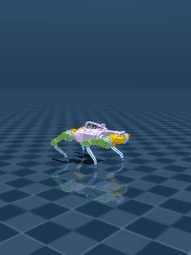
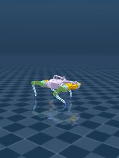
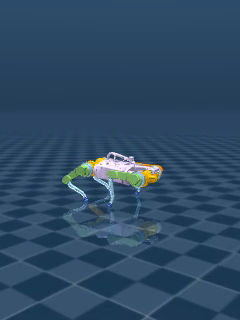

# STL-based Quadruped Locomotion

This repository implements a reinforcement-learning framework for agile quadruped locomotion using Signal Temporal Logic (STL) robustness as the main reward signal. The current code targets the Google Barkour quadruped model in MuJoCo MJX/Brax and trains PPO policies that switch across walk, trot, and bound regimes from commanded body velocities.

The project is intended for research workflows where the reward is not just a scalar task heuristic, but a structured set of temporal constraints over safety, command tracking, gait timing, and contact patterns.

## Robot Videos

Short rollout clips are included in [`assets/videos/`](assets/videos/). Click a preview to open the corresponding video.

| Behavior | Preview | Command | Video |
| --- | --- | --- | --- |
| Walk | [](assets/videos/walk.mp4) | `vx = 0.4 m/s` | [`walk.mp4`](assets/videos/walk.mp4) |
| Trot | [](assets/videos/trot.mp4) | `vx = 1.2 m/s` | [`trot.mp4`](assets/videos/trot.mp4) |
| Bound | [](assets/videos/bound.mp4) | `vx = 1.9 m/s` | [`bound.mp4`](assets/videos/bound.mp4) |

## What This Code Does

- Defines an MJX/Brax `BarkourEnv` environment around the MuJoCo Menagerie Barkour model.
- Maintains rolling histories of torques, contacts, foot positions, base velocities, CoM height, roll, pitch, and slip proxies.
- Computes STL-inspired robustness terms for:
  - safety: torque margins, CoM height, roll, pitch, and related stability margins
  - tracking: commanded forward/lateral/yaw velocity
  - timing: stride period and duty factor
  - gait pattern: walk, trot, and bound contact-structure predicates
- Trains PPO policies with domain randomization over friction and actuator parameters.
- Evaluates trained policies using rollout videos, reward-component traces, cost of transportation, survival rate, and command-tracking success.

## Repository Layout

| Path | Purpose |
| --- | --- |
| [`src/Barkour.py`](src/Barkour.py) | MJX/Brax Barkour environment, command sampling, mode switching, observations, rewards, rendering |
| [`src/stl_reward.py`](src/stl_reward.py) | STL robustness-style reward computation from rolling histories |
| [`configs/coeff_config.py`](configs/coeff_config.py) | Mode-conditioned thresholds, margins, gait parameters, and reward weights |
| [`configs/reward_config.py`](configs/reward_config.py) | Reward metric key configuration for STL and baseline rewards |
| [`src/training.py`](src/training.py) | PPO training entry point from scratch |
| [`src/training_curriculum.py`](src/training_curriculum.py) | PPO curriculum/fine-tuning entry point from an existing checkpoint |
| [`src/testing.py`](src/testing.py) | Single-policy rollout script for visual inspection |
| [`src/test_updated.py`](src/test_updated.py) | Batch evaluation script for CoT, survival, and success metrics |
| [`analysis/testing_reward_tracking_with_plots.py`](analysis/testing_reward_tracking_with_plots.py) | Reward-component rollout logging and plotting |
| [`expert_dataset_collector/`](expert_dataset_collector/) | Dataset collection utilities for reward tuning |
| [`mjx.yml`](mjx.yml) | Conda environment snapshot used for MJX/Brax experiments |

## Setup

The environment file is a full Conda snapshot from the development machine. It includes CUDA-enabled JAX, MuJoCo, MJX, Brax, Flax, Orbax, and analysis dependencies.

```bash
conda env create -f mjx.yml
conda activate mjx
```

The Barkour XML assets are expected at:

```text
mujoco_menagerie/google_barkour_vb/scene_mjx.xml
```

Clone MuJoCo Menagerie into the repository root, or update `BARKOUR_ROOT_PATH` in [`src/Barkour.py`](src/Barkour.py) to point to your local model assets.

```bash
git clone https://github.com/google-deepmind/mujoco_menagerie.git
```

Most scripts import modules from both `src/` and `configs/`. From the repository root, set:

```bash
export PYTHONPATH="$PWD/src:$PWD/configs:$PYTHONPATH"
```

For headless GPU rendering, the scripts default to:

```bash
export MUJOCO_GL=egl
```

## Training

Train a policy from scratch:

```bash
python src/training.py
```

Fine-tune from an existing checkpoint:

```bash
python src/training_curriculum.py
```

Both training scripts currently contain machine-specific checkpoint paths. Before running on a new machine, update the checkpoint output paths and, for curriculum training, the `restore_checkpoint_path`.

## Evaluation

Render a rollout from a trained checkpoint:

```bash
python src/testing.py
```

Run the batch evaluator for multiple commanded forward velocities:

```bash
python src/test_updated.py \
  --ckpt-path /path/to/orbax/checkpoint \
  --num-tests 20 \
  --horizon 500 \
  --velocities 0.3 0.5 0.7 1.0 1.3 1.6 1.9
```

This writes per-rollout metrics, summary CSV, and summary JSON files. By default, these generated result files are ignored by git.

## Method Summary

At each control step, the environment records a fixed-length history window and evaluates robustness margins over that window. The active gait mode is determined from commanded forward speed with hysteresis:

- walk for low forward-speed commands
- trot for mid-speed commands
- bound for high-speed commands

The reward combines normalized robustness groups:

```text
reward = w_safe * tanh(rho_safety / alpha_safe)
       + w_track * tanh(rho_tracking / alpha_track)
       + w_pattern * tanh(rho_pattern / alpha_pattern)
       - gamma_tau * torque_effort
```

Timing and pattern robustness terms are mode-conditioned, so the same policy can be trained across walk, trot, and bound command regimes while preserving interpretable reward diagnostics.

## Citing

This repository includes [`CITATION.cff`](CITATION.cff), so GitHub will show a **Cite this repository** button. A plain-text citation template is:

```text
Merve Atasever. STL-based Quadruped Locomotion. GitHub repository:
https://github.com/M-Atasever/STL-based-Quadruped-Locomotion
```
